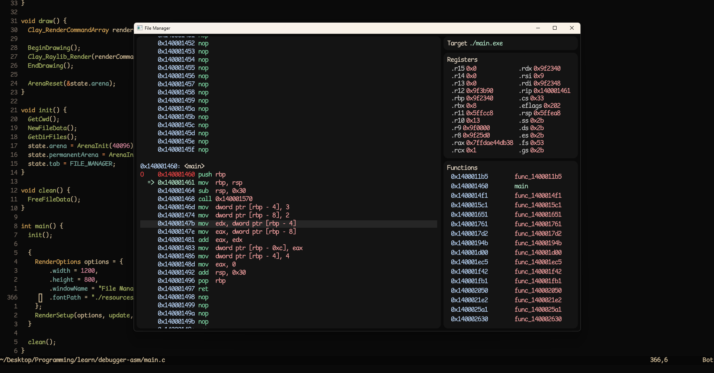

# Intro

- Not finished probably and wont be either since Windows APIs are boring and annoying
- Definitely not usable, barely works on some cases :D

Example:

## General:
- [ ] Add asserts everywhere
- [ ] Fix all warnings
- [ ] Change functions to static and lowerCase if not used globally
- [ ] Don't use relative keypress but QWERTY ones

## Debugger:
- [x] Remove non existent registers
- [x] Array of function names and addresses
- [x] When performance problems change to hashMap instead of Vector
- [x] Once we know where main is, then center view on there
- [x] Change `DebuggerGoToNextBreakpoint` to `Next` and step through SIGSEGV and SIGTRAPS (ep. 3)
- [x] Remove breakpoint on each step
- [ ] Show segfault
- [ ] Make it not reliant on disable-dynamicbase add offset

## UI:
- [x] Add align, tl, tc, tr, etc.
- [x] Border radius, br.
- [x] Move color to renderers add all the colors from 50-950
- [x] Scroll in general
- [x] Border
- [x] Fix font height size
- [ ] Antialiasing on border radius
- [ ] Create function that selects fontId based on fontSize, load 8-72 to avoid blurriness
- [ ] ^ Better way of creating `Clay_TextElementConfig`
- [ ] Figure out how to get correct textHeight
- [ ] Follow tailwind guidelines better

## Renderer - When Available:
- [ ] Individual CornerRadius when available
- [ ] Reverse when available
- [ ] Margin when available
